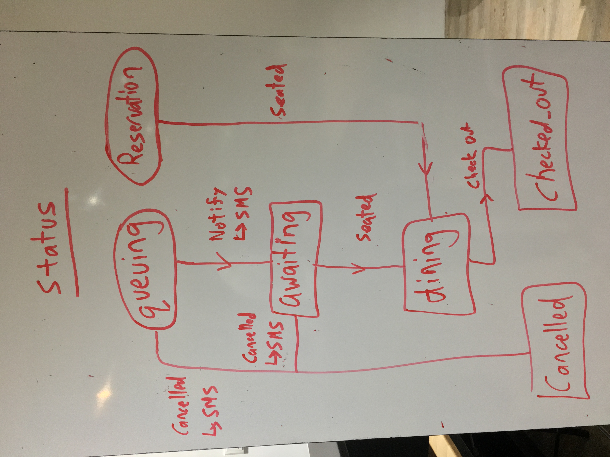
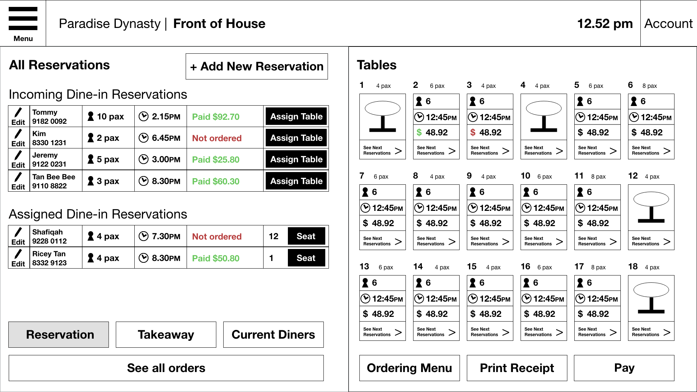
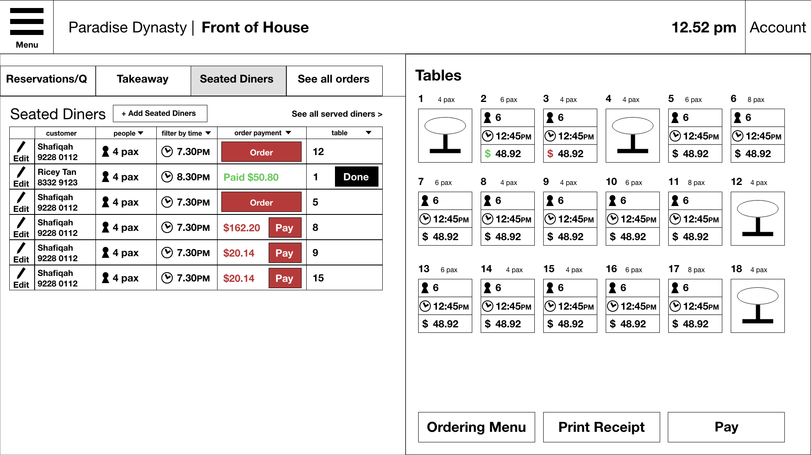
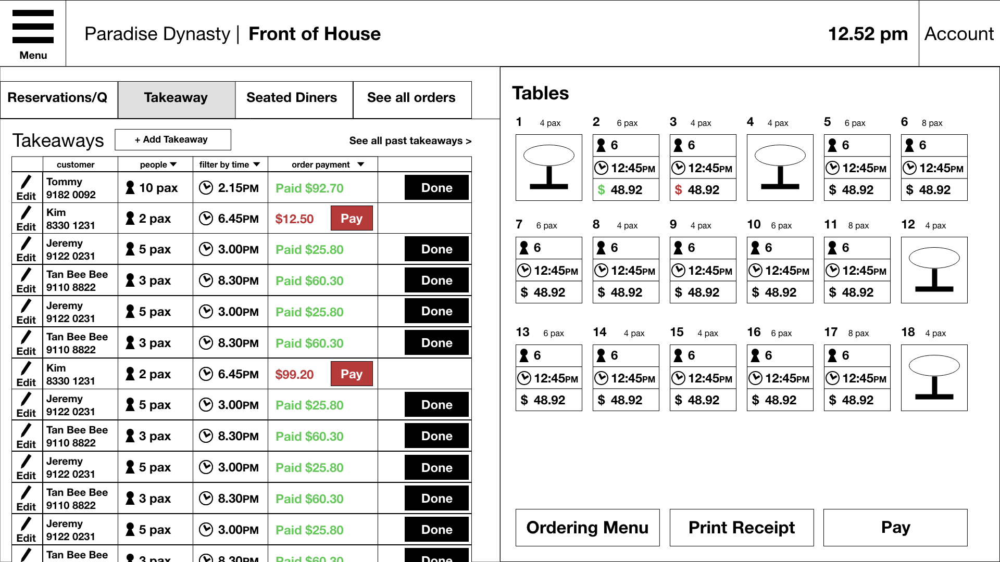
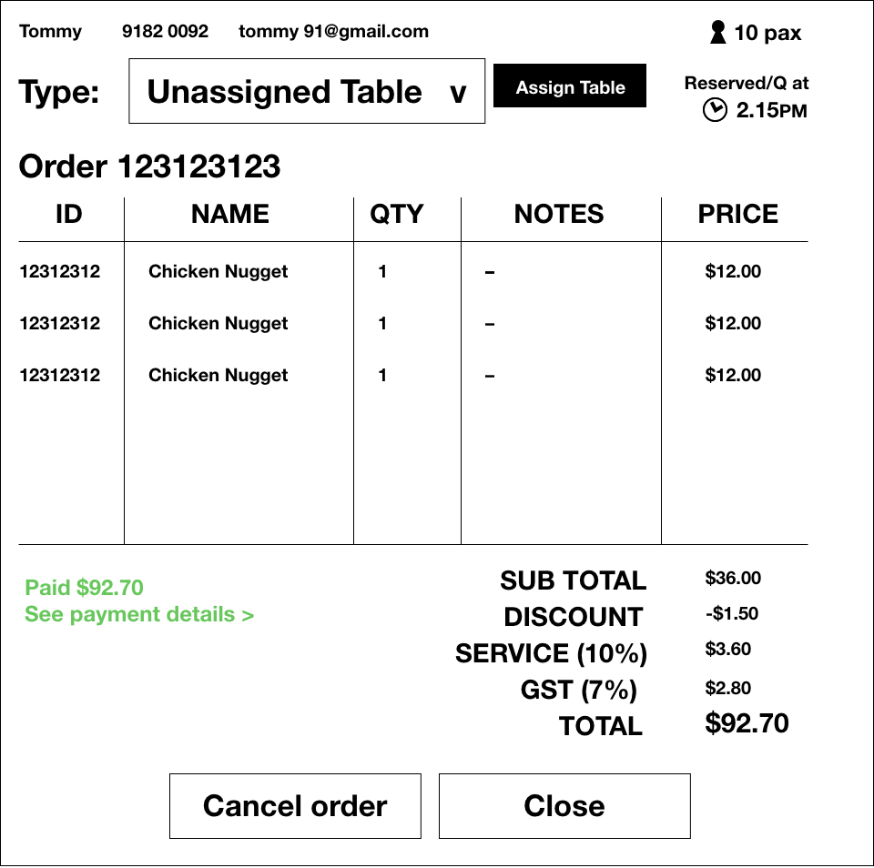
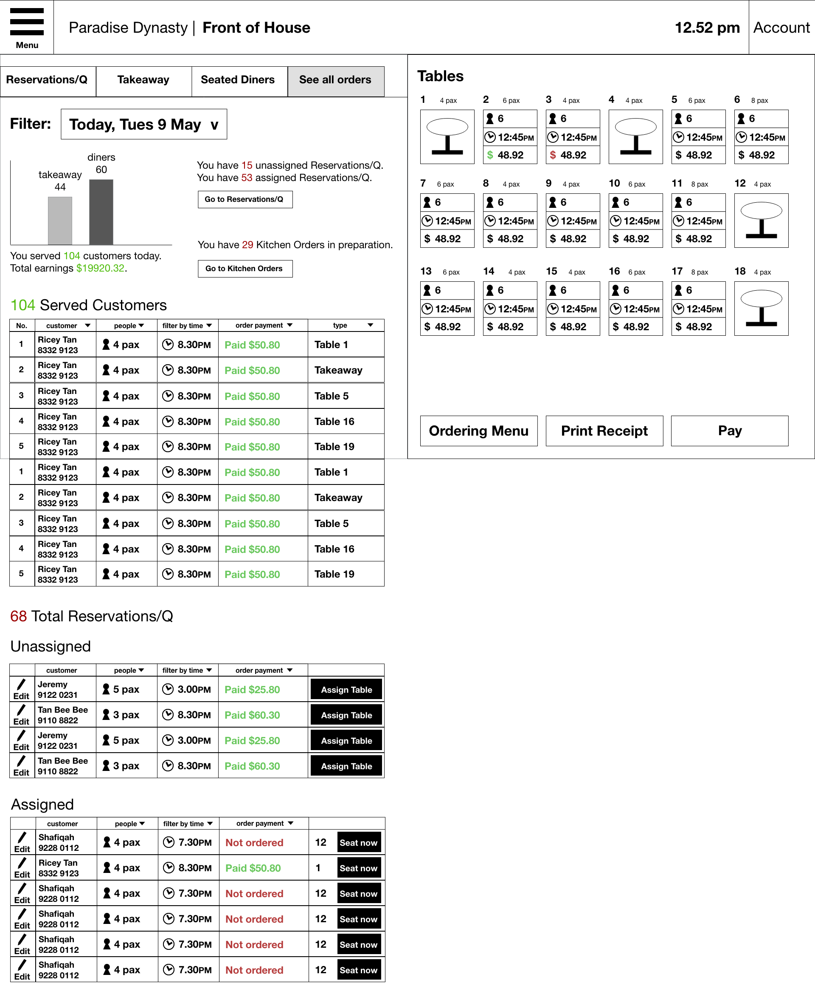
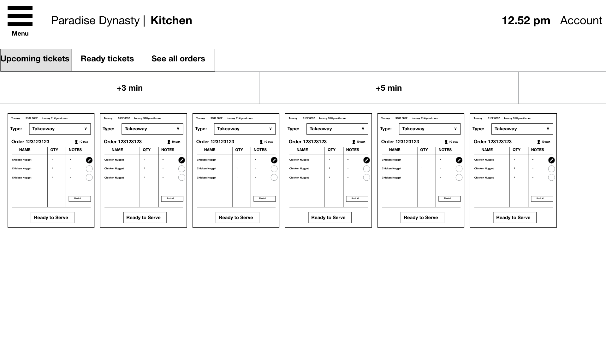

# Locavorus _Rex_


[**Locavorus**](https://locavorusrex.herokuapp.com/) is a (work-in-progress) web application for restaurants and other food businesses to manage their reservations, queue and orders. It aims to reduce the time needed for customers to wait for their food to be served by allowing them to place their others beforehand. It also aims to reduce queues by notifying customers when their turn is up.

## The Project

### Objective

:white_check_mark: Queuing front end to accept walk-ins with customer SMS notifications and ability to submit food order online

:white_check_mark: Reservation front end to make reservations with email confirmations

:white_check_mark: Takeaway front end to process takeaway orders with email confirmations

:white_check_mark: Reservation and queuing backend with automatic assignation, ordering and notification

:white_check_mark: Order backend to process takeaway and local orders with logic to prioritise orders

:white_check_mark: Simple interface to find restaurants and view details

:white_check_mark: Simple interface to manage user accounts and business dashboard

## Getting Started
### Prerequisites

This project is built with [Ruby on Rails](http://rubyonrails.org/) and [PostgreSQL](https://www.postgresql.org/). Download and install them before proceeding to the following steps to install the application.

#### Installing

Fork, clone or download this repository to your desired directory. Install the required GEM files by entering the following code in your terminal in the directory.

```
bundle install
```

Run the following code to reset the database and populate it with seed data.

```
rails db:reset
```

#### Deployment
This application is deployed on Heroku and can be accessed [here](https://locavorusrex.herokuapp.com/). (if it hasn't been taken down already)


### Built With
* Ruby on Rails
* PostgreSQL
* ERB (embedded ruby)
* CSS
* jQuery


### Using the Application

#### Customer


#### Restaurant Employees


## Development

### Entity Relationship Diagram (ERD)


### Models
* User
* Order
* Restaurant
* Reservation
* Menu
* Table
* Invoice (previously known as 'Transaction')

## Notable Areas
### Table-finding Logic
1. Find all tables in the restaurant.
2. Find all unavailable tables where the start time of the reservation is before the end time of that table OR the end time of the reservation is after the start time of that table.

3. Remove these unavailable tables from all tables in that restaurant.
4. From the remaining tables, filter out and accept only the tables with capacity greater than or equal to the number of diners.
5. Sort these tables in ascending order of capacity and select the first table in the array to reduce inefficiencies in seating. E.g. Assigning 2 people to an empty table meant for 6 people.

### Queuing Logic
Tables will only be assigned when a diner is 'queuing' or when an existing diner is 'checked out'.

1. Use table-finding logic to find unoccupied tables and submit a reservation with `DateTime.now`.
2. If there are no available tables, add the user to the queue.
3. When a diner checks out, run the table-finding logic again to find future reservations.
4. If there are no future reservations, assign a table to the 'queuer' and send an SMS using `Twilio` to inform the 'queuer' that they can make their way to the restaurant.

### Payment Logic

### Website Wireframes
**Dashboard**


**Nav Bar Dropdown**


## Future Development
### Wireframes for possible future features
**View Seated Diners**


**Takeaway Dashboard**


**Order Chit**


**See All Orders**


**Kitchen View of Upcoming Tickets**


**Kitchen View of Ready Tickets**


### Bugs


### Authors
[Louisa Lee](https://github.com/imouto2005)

[Jonathan Louis Ng](https://github.com/noll-fyra)

[Darrell Teo](https://github.com/darrelltzj)

Jasmine Lee

### Acknowledgments
